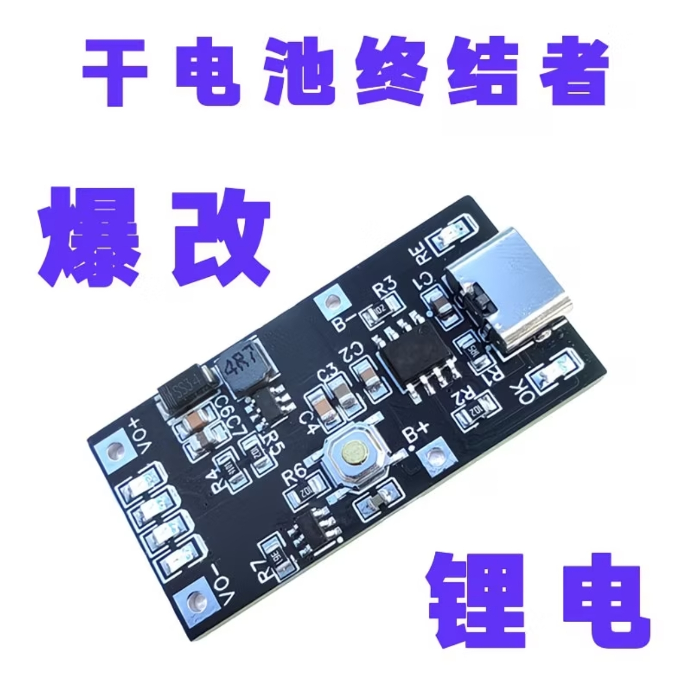

# Pentax 645N / 645N II Lithium Battery Holder

3D-printable battery holder for converting a Pentax 645N or Pentax 645N II battery insert to a rechargeable lithium battery setup. The design is sized around a 103450 3.7 V LiPo pouch cell and a small lithium charge/boost board.

中文版: [README.zh-CN.md](README.zh-CN.md)

> Safety note: this is a DIY camera power modification. Verify the boost board output voltage and output polarity with a multimeter before inserting the holder into a camera. Use insulated wiring, avoid exposed contacts, and do not charge or operate damaged/swollen LiPo cells.

## Design Philosophy

The original Pentax 645N/645N II battery holder uses six AA alkaline batteries. That works, but it is not ideal for frequent use: disposable alkaline cells create avoidable waste, need to be replaced often, and make it easy to end up carrying extra batteries just to keep the camera running.

This project replaces that consumable-heavy setup with a rechargeable lithium pack. The goal is to keep these medium-format cameras practical for daily use while reducing reliance on single-use AA cells. A LiPo cell with a charge/boost board offers several advantages:

- Rechargeable power instead of repeatedly buying and discarding alkaline batteries.
- USB-C charging, including from a wall charger, power bank, or field charging setup.
- A more compact internal power layout built around one pouch cell and regulated output electronics.

## Compatible Models

- Pentax 645N
- Pentax 645N II

## Repository Contents

| Path | Description |
| --- | --- |
| `models/` | STL files for printing the holder and small contact/retainer parts. |
| `images/` | Reference renders and material photos. |
| `docs/bill-of-materials.md` | Parts list for the printed holder, electronics, fasteners, and wiring. |
| `docs/printing-and-assembly.md` | Suggested print settings and assembly checklist. |

## STL Files

All STL dimensions are in millimeters. Import at 100% scale.

| File | Approx. dimensions |
| --- | ---: |
| `models/pentax-645n-lithium-holder-body.stl` | 52.03 x 30.33 x 64.87 mm |
| `models/pentax-645n-lithium-holder-locking-base.stl` | 61.59 x 36.36 x 16.00 mm |
| `models/pentax-645n-lithium-holder-top-contact-retainer.stl` | 14.43 x 20.59 x 7.89 mm |
| `models/pentax-645n-lithium-holder-lower-contact-spacer.stl` | 12.09 x 24.78 x 5.48 mm |
| `models/pentax-645n-lithium-holder-bottom-contact-retainer.stl` | 15.02 x 21.20 x 3.69 mm |

## Print Notes

- Units: millimeters.
- Recommended process: SLA/MSLA/DLP resin printing for better dimensional accuracy and small contact/screw features.
- Recommended resin: tough resin, ABS-like resin, or other engineering resin with good impact resistance.
- Resin layer height: 0.03-0.05 mm.
- Supports: enable where your slicer shows unsupported overhangs, especially inside the main body and locking base. For resin printing, orient the parts to avoid suction cups and to protect contact surfaces.

Always test fit the printed parts before installing electronics.

## Materials

See [docs/bill-of-materials.md](docs/bill-of-materials.md) for the full list.

Core parts:

- 103450 3.7 V LiPo pouch cell, about 2000 mAh.
- USB-C lithium charge/boost module with `B+`, `B-`, `VO+`, and `VO-` pads.
- M2.5 x 6 mm brass thumb screw.
- M2.5 brass hex nut.
- M1.2 x 3 mm brass screw.
- Copper/brass/nickel strip for battery contacts, wire, heat-shrink, and insulation tape.

## Assembly Overview

1. Print all STL files at 100% scale.
2. Deburr the shell, contact slots, and screw holes.
3. Install the M2.5 nut/screw hardware and small printed retainers.
4. Fit the 103450 LiPo cell and charge/boost board.
5. Wire the LiPo to `B+`/`B-`, then wire the regulated output pads to the holder contacts.
6. Confirm voltage and polarity at the final camera-facing contacts with a multimeter.
7. Insulate exposed joints, close the holder, and do a camera fit check.

## License

This project is released under the Creative Commons Attribution 4.0 International License. See [LICENSE](LICENSE).

Pentax is a trademark of Ricoh Imaging Company, Ltd. This project is an independent community design and is not affiliated with or endorsed by Ricoh/Pentax.
