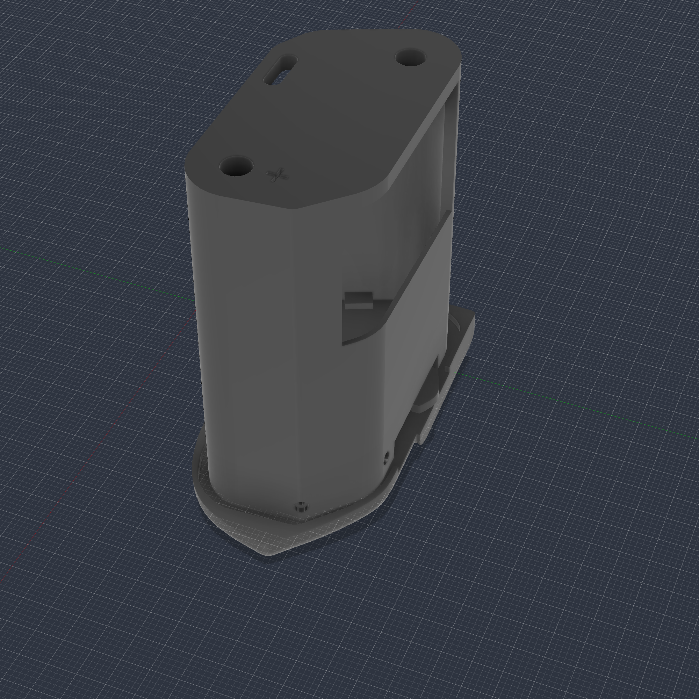
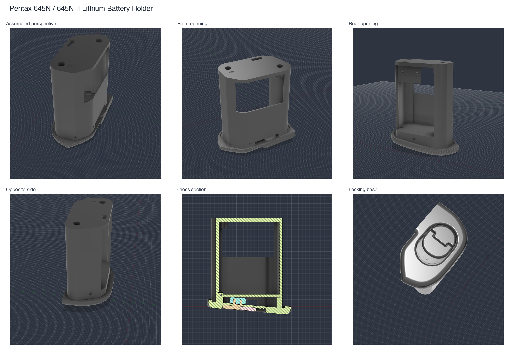
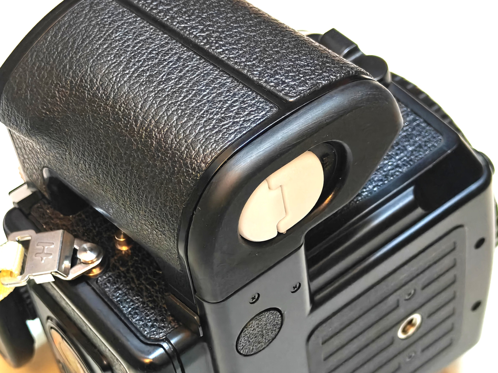
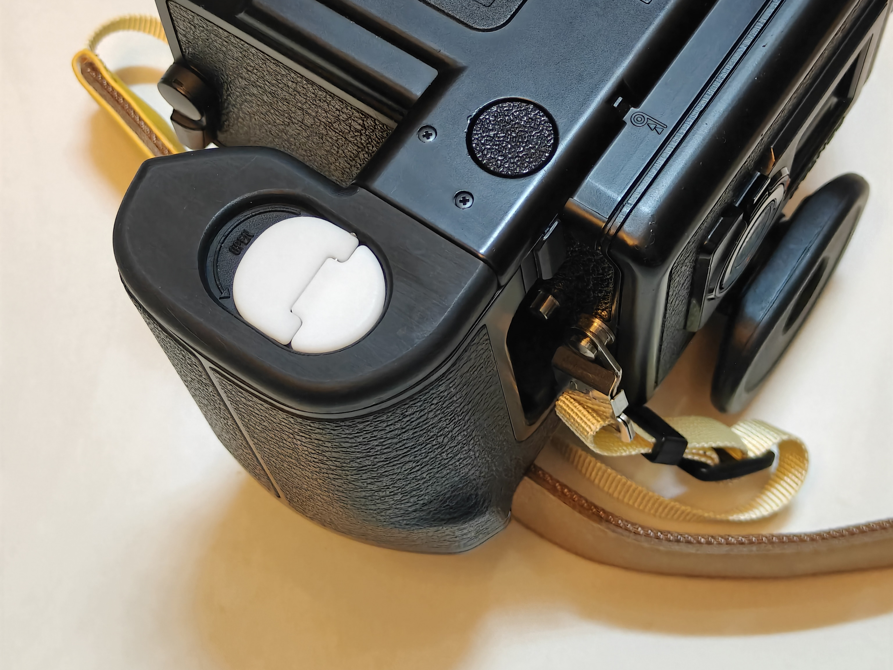
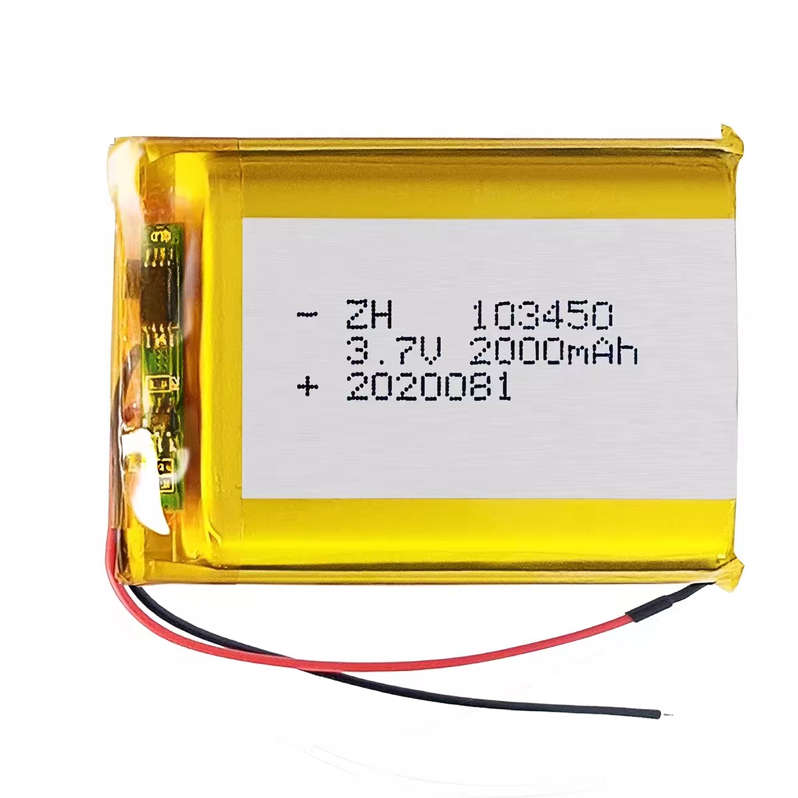
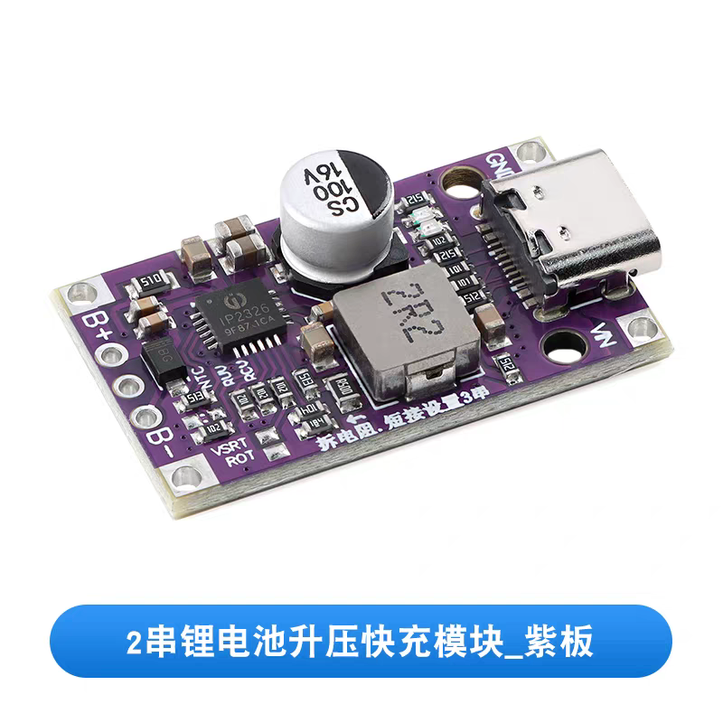
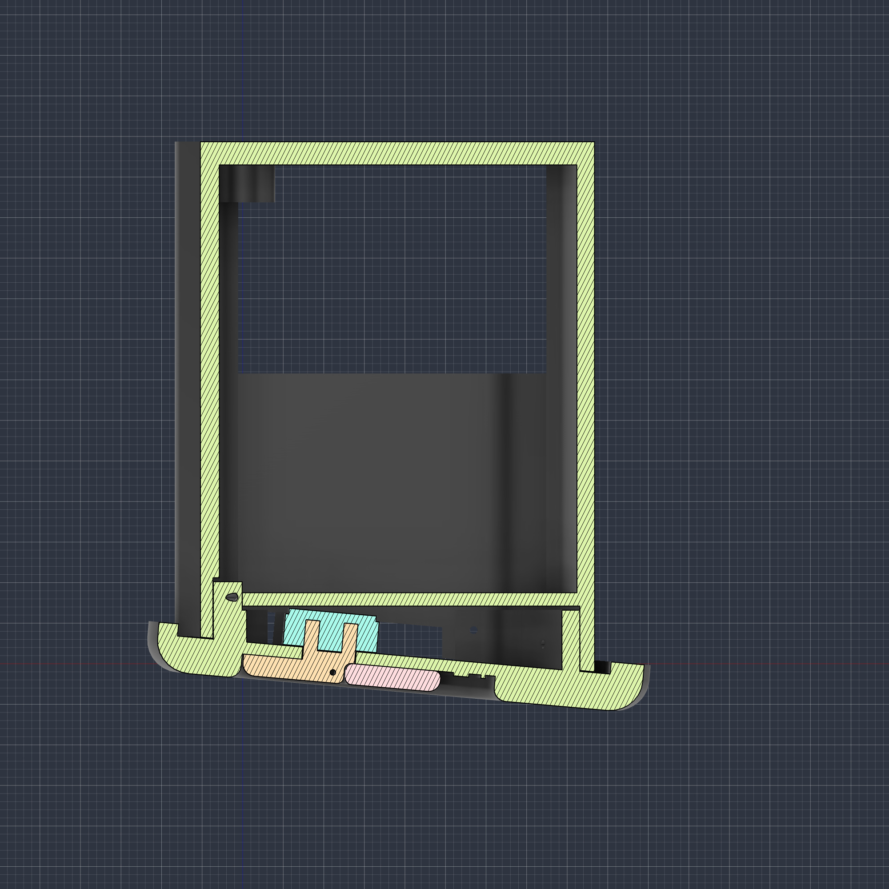

# Pentax 645N / 645N II Lithium Battery Holder

3D-printable battery holder for converting a Pentax 645N/645N II battery holder to rechargeable lithium power. The current design uses two 3.7 V lithium cells in series (2S: 7.4 V nominal, 8.4 V fully charged) with a 2S USB-C charge/boost module.

中文版: [点此跳转](README.zh-CN.md)

> Safety note: this is a DIY camera power modification. Use two cells of the same model, capacity, age, and state of charge. Verify the module output voltage, polarity, and absence of shorts with a multimeter before inserting the holder into a camera. Insulate all joints and contacts, and never use damaged, swollen, or overheating cells.

## Design Philosophy

The original Pentax 645N/645N II battery holder uses six AA alkaline batteries. That works, but it is not ideal for frequent use: disposable alkaline cells create avoidable waste, need to be replaced often, and make it easy to end up carrying extra batteries just to keep the camera running.

This project replaces that consumable setup with a rechargeable lithium pack. The goal is to keep these medium-format cameras practical for daily use while reducing reliance on single-use AA cells. Two series-connected lithium cells with a 2S charge/boost module offer several advantages:

- Rechargeable power instead of repeatedly buying and discarding alkaline batteries.
- USB-C charging, including from a wall charger, power bank, or field charging setup.
- A 7.4 V nominal 2S pack is sufficient regarding the voltage required by the camera.

## Compatible Models

- Pentax 645N
- Pentax 645N II

## Repository Contents

| Path | Description |
| --- | --- |
| `models/` | STL files for printing the holder and small contact/retainer parts. |
| `images/` | Reference renders and material photos. |
| `docs/bill-of-materials.md` | Parts list for the printed holder, electronics, fasteners, and wiring. |
| `docs/printing-and-assembly.md` | Suggested print settings and assembly checklist. |

## STL Files

All STL dimensions are in millimeters. Import at 100% scale.

| File | Approx. dimensions |
| --- | ---: |
| `models/pentax-645n-lithium-holder-body.stl` | 52.03 x 29.13 x 65.37 mm |
| `models/pentax-645n-lithium-holder-locking-base.stl` | 62.08 x 36.06 x 15.94 mm |
| `models/pentax-645n-lithium-holder-top-contact-retainer.stl` | 14.43 x 20.59 x 7.89 mm |
| `models/pentax-645n-lithium-holder-lower-contact-spacer.stl` | 12.09 x 24.78 x 5.48 mm |
| `models/pentax-645n-lithium-holder-bottom-contact-retainer.stl` | 15.02 x 21.20 x 3.69 mm |

## Print Notes

- Units: millimeters.
- Recommended process: SLA resin printing for better dimensional accuracy and small contact/screw features.
- Resin layer height: 0.03-0.05 mm.
- Supports: enable where your slicer shows unsupported overhangs, especially inside the main body and locking base. For resin printing, orient the parts to avoid suction cups and to protect contact surfaces.

Always test fit the printed parts before installing electronics.

## Materials

See [docs/bill-of-materials.md](docs/bill-of-materials.md) for the full list.

Core parts:

- Two matched 3.7 V lithium cells connected in series as a 2S pack.
- USB-C charge/boost module designed for a 2S pack; follow the markings and documentation supplied with the exact module.
- M2.5 x 6 mm brass thumb screw.
- M2.5 brass hex nut.
- M1.2 x 3 mm brass screw.
- Copper/brass/nickel strip for battery contacts, wire, heat-shrink, and insulation tape.

## Assembly Overview

1. Print all STL files at 100% scale.
2. Deburr the shell, contact slots, and screw holes.
3. Install the M2.5 nut/screw hardware and small printed retainers.
4. Fit two matched 3.7 V lithium cells and the 2S charge/boost board without pinching or bending either cell.
5. Connect the cells in series and wire the pack, protection/charging connections, and regulated output exactly as specified for the module being used.
6. Confirm pack voltage, regulated output voltage, polarity, and absence of shorts at the final camera-facing contacts with a multimeter.
7. Insulate exposed joints, close the holder, and do a camera fit check.

## License

This project is released under the Creative Commons Attribution 4.0 International License. See [LICENSE](LICENSE).

Pentax is a trademark of Ricoh Imaging Company, Ltd. This project is an independent community design and is not affiliated with or endorsed by Ricoh/Pentax.
