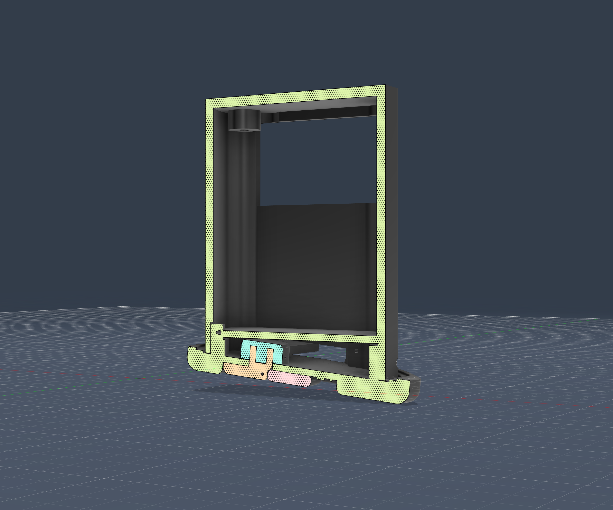
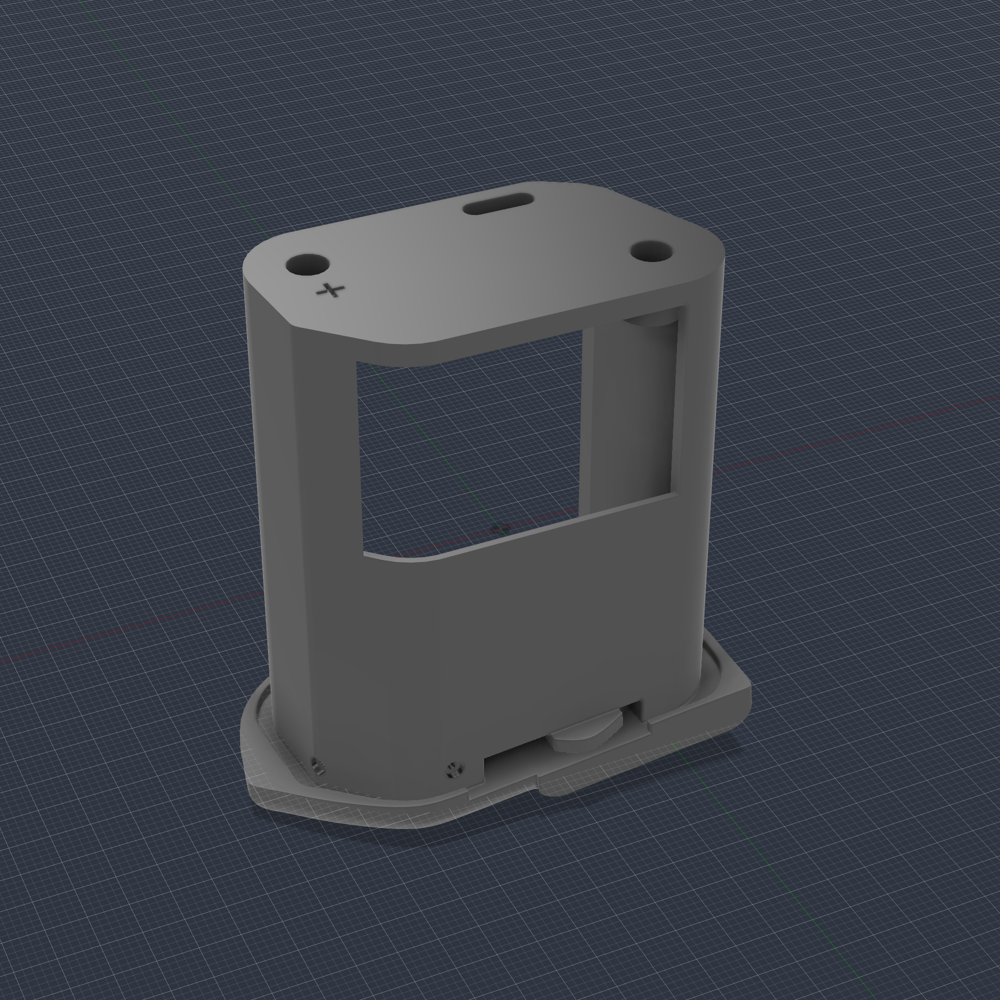
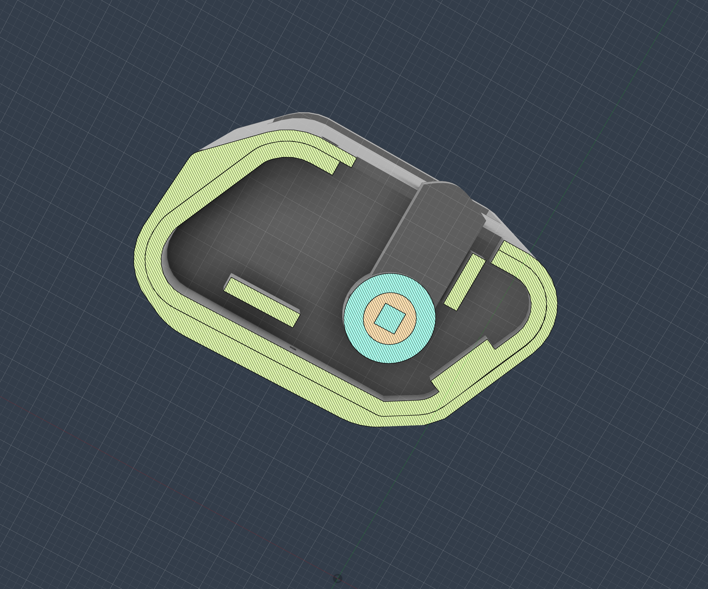
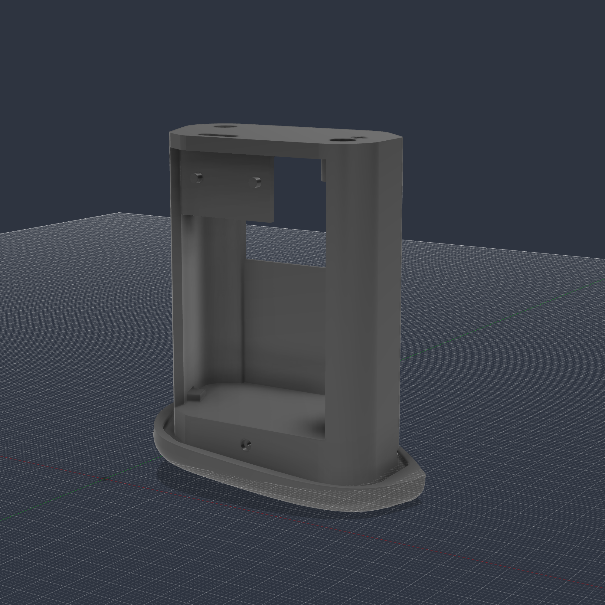

# Printing and Assembly Notes

## Printing

- Import STL files in millimeters at 100% scale.
- SLA/MSLA/DLP resin printing is recommended because the holder has small screw, contact, and locking features.
- Use tough resin, ABS-like resin, or another engineering resin with good impact resistance.
- Start with 0.03-0.05 mm resin layer height.
- Orient parts to protect the camera-facing surfaces, avoid suction cups, and keep supports away from critical contact slots where possible.

After printing, test the parts together before soldering any electronics. Lightly deburr the edges that contact the camera battery bay.

## Assembly

1. Dry-fit the main body and locking base.
2. Test the M2.5 and M1.2 hardware in the printed parts.
3. Shape the copper/brass/nickel strip contacts and confirm they sit flat in the printed retainers.
4. Place the LiPo cell in the holder without pinching or bending the pouch.
5. Mount the charge/boost board where the USB-C port and wiring remain accessible.
6. Solder the battery leads to `B+` and `B-`.
7. Solder the output leads from `VO+` and `VO-` to the camera-facing contacts.
8. Use a multimeter to check output voltage, polarity, and continuity.
9. Insulate exposed solder joints and sharp metal edges.
10. Install the holder into the camera only after the electrical checks pass.

## Reference Views

## Safety

LiPo cells can be damaged by puncture, crushing, over-discharge, over-charge, or short circuits. If the cell becomes hot, swollen, punctured, or smells unusual, stop using it immediately and dispose of it according to local battery rules.
